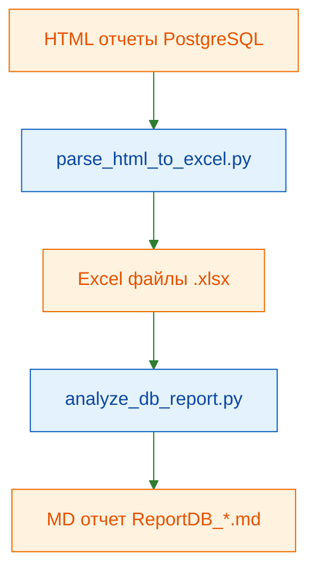

# PostgreSQL HTML Report to Excel Parser

Скрипт для парсинга HTML-отчетов PostgreSQL и конвертации данных в формат Excel.

## 📋 Описание

Этот инструмент извлекает данные из HTML-отчетов PostgreSQL (созданных различными инструментами мониторинга), парсит встроенные JSON данные и сохраняет их в удобном формате Excel с отдельными листами для каждого набора данных.

## ✨ Возможности

- 🔍 Автоматическое извлечение JSON данных из HTML файлов
- 📊 Парсинг вложенных структур данных
- 📑 Создание отдельных листов Excel для каждого набора данных
- 🛡️ Обработка сложных JSON структур с учетом вложенности
- 📈 Поддержка различных типов данных PostgreSQL статистики
- ⚡ Детальный вывод процесса обработки
- 🔄 **Пакетная обработка множества файлов**
- 🎯 **Поддержка масок (wildcards) для выбора файлов**
- 📊 **Автоматический DBA анализ с генерацией отчетов**
- 🏷️ **Уникальные имена выходных файлов**
- ✨ **Форматирование Excel: цветные заголовки и строки**
- 🔍 **Автофильтр на всех столбцах**
- 📏 **Автоматическое растягивание столбцов**

## 🚀 Установка

### Требования

- Python 3.7+
- pip (менеджер пакетов Python)

### Зависимости

Установите необходимые библиотеки:

```bash
pip install pandas openpyxl beautifulsoup4
```

Или используйте requirements.txt:

```bash
pip install -r requirements.txt
```

## 📖 Использование

### Базовое использование

#### 1. Парсинг HTML в Excel

**Один файл:**
```bash
python parse_html_to_excel.py "report.html"
```

**Несколько файлов:**
```bash
python parse_html_to_excel.py "20 RPS.html" "40 RPS.html"
```

**Все HTML файлы в папке:**
```bash
python parse_html_to_excel.py *.html
```

**Файл по умолчанию (без аргументов):**
```bash
python parse_html_to_excel.py
```

Скрипт автоматически создаст Excel файл с тем же именем:
- `20 RPS.html` → `20 RPS.xlsx`
- `40 RPS.html` → `40 RPS.xlsx`

#### 2. Анализ Excel и создание DBA отчета

**Один файл:**
```bash
python analyze_db_report.py "report.xlsx"
```

**Несколько файлов:**
```bash
python analyze_db_report.py "20 RPS.xlsx" "40 RPS.xlsx"
```

**Все Excel файлы в папке:**
```bash
python analyze_db_report.py *.xlsx
```

**Файл по умолчанию (без аргументов):**
```bash
python analyze_db_report.py
```

Скрипт создаст MD отчет с уникальным именем:
- `20 RPS.xlsx` → `ReportDB_20 RPS.md`
- `40 RPS.xlsx` → `ReportDB_40 RPS.md`

### Полный пайплайн обработки

```bash
# Шаг 1: Конвертация HTML в Excel (все файлы)
python parse_html_to_excel.py *.html

# Шаг 2: Анализ всех созданных Excel файлов
python analyze_db_report.py *.xlsx
```

## 🗺️ Диаграмма проекта



### Настройка файлов по умолчанию

Измените глобальные переменные в скриптах:

**parse_html_to_excel.py:**
```python
DEFAULT_HTML_FILE = "ваш_файл.html"
```

**analyze_db_report.py:**
```python
DEFAULT_EXCEL_FILE = "ваш_файл.xlsx"
# Исключаемые БД из раздела общей статистики
EXCLUDED_DATABASES = {"postgres", "Total"}

# Пороги/критерии (все настраиваются)
DB_CACHE_HIT_WARN = 95
DB_CACHE_HIT_CRITICAL = 90
ROLLBACK_RATIO_WARN = 5
QUERY_MEAN_TIME_WARN_MS = 1000
QUERY_CACHE_HIT_WARN = 90
WAL_RATE_WARN_MB_MIN = 50
WAL_RATE_CRITICAL_MB_MIN = 100
FPI_RATIO_WARN = 5
TABLE_DEAD_TUPLES_WARN = 20
TABLE_DEAD_TUPLES_CRITICAL = 30
TABLE_MOD_SINCE_ANALYZE_WARN = 20
TABLE_MOD_SINCE_ANALYZE_EXTENDED_WARN = 50
TABLE_SEQ_SCAN_WARN = 100
HEAP_CACHE_HIT_WARN = 90
HEAP_CACHE_HIT_CRITICAL = 80
INDEX_CACHE_HIT_WARN = 95
BUFFER_REUSE_WARN = 95
SEQ_SCAN_LARGE_TABLE_MB = 100
SEQ_SCAN_RATE_WARN_PER_MIN = 1
IO_TIME_RATIO_WARN = 0.30
```

### Настройка форматирования Excel

В `parse_html_to_excel.py` можно настроить внешний вид Excel файлов:

```python
# Цвет заголовков (RGB)
HEADER_COLOR_RGB = (144, 238, 144)  # Светло-зеленый

# Цвет строк данных (RGB)
ROW_COLOR_RGB = (240, 255, 240)     # Honey dew (светло-бежевый)

# Автофильтр на заголовках
ENABLE_AUTOFILTER = True            # True или False

# Автоматическое растягивание столбцов
ENABLE_AUTOFIT_COLUMNS = True       # True или False
```

**Примеры цветов RGB:**
- `(144, 238, 144)` - светло-зеленый (Light Green)
- `(240, 255, 240)` - honey dew (светло-кремовый)
- `(127, 255, 212)` - аквамарин (Aquamarine)
- `(255, 250, 205)` - лимонный шифон (Lemon Chiffon)
- `(230, 230, 250)` - лаванда (Lavender)
- `(224, 255, 255)` - светлый голубой (Light Cyan)

**Применяемое форматирование:**
- ✨ Заголовки окрашены и сделаны жирными
- 📊 Строки данных окрашены для лучшей читаемости
- 🔍 Автофильтр на всех столбцах (когда ENABLE_AUTOFILTER = True)
- 📏 Столбцы автоматически растягиваются по содержимому (когда ENABLE_AUTOFIT_COLUMNS = True)

### Справка по командам

Для получения помощи по использованию:
```bash
python parse_html_to_excel.py --help
python analyze_db_report.py --help
```

## 🎯 Критерии анализа и пороговые значения

Скрипт `analyze_db_report.py` использует следующие правила для определения проблем в базе данных:

### 📊 Статистика баз данных

| Метрика | Норма | Предупреждение | Критично |
|---------|-------|----------------|----------|
| **Cache Hit Ratio** | ≥ 95% | < 95% | < 90% |
| **Rollback Ratio** | < 5% | ≥ 5% | - |
| **Deadlocks** | 0 | > 0 | - |
| **Временные файлы** | 0 | > 0 | - |

**Критерии оценки:**
- ✅ **Cache Hit Ratio ≥ 95%**: Отличная работа кэша
- ⚠️ **Cache Hit Ratio < 95%**: Низкий cache hit ratio - возможно недостаточно `shared_buffers`
- 🔴 **Cache Hit Ratio < 90%**: Критично низкий cache hit - требуется увеличение памяти
- ⚠️ **Rollback Ratio ≥ 5%**: Высокий процент откатов транзакций
- ⚠️ **Deadlocks > 0**: Обнаружены взаимные блокировки
- ⚠️ **Temp Files > 0**: Использование временных файлов на диске (мало `work_mem`)

### 🧠 Память и кэш

| Метрика | Норма | Предупреждение | Критично |
|---------|-------|----------------|----------|
| **Heap Cache Hit Ratio** | ≥ 90% | < 90% | < 80% |
| **Index Cache Hit Ratio** | ≥ 95% | < 95% | - |
| **Buffer Reuse Ratio** | < 95% | ≥ 95% | - |

**Критерии оценки:**
- ⚠️ **Heap Hit Ratio < 90%**: Таблица часто читает с диска - проверка индексов/кэша
- ⚠️ **Index Hit Ratio < 95%**: Индексы не помещаются в память
- ⚠️ **Buffer Reuse ≥ 95%**: Слишком много переиспользования буферов - увеличить `shared_buffers`

### 🔥 Производительность запросов

| Метрика | Норма | Предупреждение |
|---------|-------|----------------|
| **Среднее время выполнения** | < 1000 мс | ≥ 1000 мс |
| **Query Cache Hit Ratio** | ≥ 90% | < 90% |
| **Временные блоки** | 0 | > 0 |

**Критерии оценки:**
- ⚠️ **Mean Time ≥ 1000 мс**: Медленный запрос - требуется оптимизация
- ⚠️ **Query Cache Ratio < 90%**: Низкий cache hit для запроса - проверить индексы
- ⚠️ **Temp Blocks > 0**: Запрос использует временные файлы - увеличить `work_mem`

### 📝 Генерация WAL (Write-Ahead Log)

| Скорость генерации | Оценка | Рекомендация |
|-------------------|--------|--------------|
| < 50 MB/мин | ✅ Нормальная | - |
| 50-100 MB/мин | ⚡ Умеренная | Мониторить |
| > 100 MB/мин | ⚠️ Высокая | Проверить объем операций записи |

**Анализ WAL:**
- В отчете показываются топ-5 запросов по генерации WAL (`wal_bytes`)
- Процент от общего объема WAL за период мониторинга
- Основные генераторы: INSERT, UPDATE, DELETE операции

### 🧲 I/O и диски

| Метрика | Норма | Предупреждение |
|---------|-------|----------------|
| **Seq Scan на больших таблицах** | Низкий | > 1/мин при размере > 100MB |
| **I/O Time Ratio** | < 30% | ≥ 30% от времени запроса |

**Критерии оценки:**
- ⚠️ **Seq Scan**: высокая доля последовательных сканирований на больших таблицах
- ⚠️ **I/O Time Ratio ≥ 30%**: запросы тратят много времени на диск

### 🗂️ Таблицы и обслуживание

| Метрика | Норма | Проблема |
|---------|-------|----------|
| **Dead Tuples Ratio** | < 20% | ≥ 20% от live tuples |
| **Modifications since ANALYZE** | < 20% | ≥ 20% от live tuples |
| **Sequential Scans** | Зависит от размера | > 100 на таблицах > 10,000 строк |

**Критерии оценки:**
- ⚠️ **Dead Tuples ≥ 20%**: Много мертвых строк (bloat) - требуется `VACUUM`
  - **Формула**: `(dead_tuples / live_tuples) * 100 ≥ 20%`
  - **Рекомендация**: Выполнить `VACUUM ANALYZE схема.таблица;`

- ⚠️ **Mod. since ANALYZE ≥ 20%**: Устаревшая статистика планировщика
  - **Формула**: `n_mod_since_analyze > live_tuples * 0.2`
  - **Рекомендация**: Выполнить `ANALYZE схема.таблица;`

- ⚠️ **Seq Scan > 100 на больших таблицах**: Возможно отсутствуют нужные индексы
  - **Условие**: `seq_scan > 100 AND live_tuples > 10,000`
  - **Рекомендация**: Рассмотреть создание индекса для частых запросов

### 🧽 Расширенное обслуживание таблиц (bloat)

| Метрика | Норма | Предупреждение | Критично |
|---------|-------|----------------|----------|
| **Dead Tuples Ratio** | < 20% | ≥ 20% | > 30% |
| **Modifications since ANALYZE** | < 50% | ≥ 50% | - |

**Критерии оценки:**
- ⚠️ **Dead Tuples > 30%**: Критичный bloat - нужен `VACUUM FULL`
- ⚠️ **Mod. since ANALYZE ≥ 50%**: Устаревшая статистика - нужен `ANALYZE`

### 🔍 Индексы

| Состояние | Критерий | Рекомендация |
|-----------|----------|--------------|
| **Неиспользуемые** | `idx_scan = 0` за период мониторинга | Рассмотреть удаление |

**Критерии оценки:**
- 🔍 **Unused Indexes**: Индексы с нулевым количеством сканирований
  - Занимают место на диске
  - Замедляют операции INSERT/UPDATE
  - **Рекомендация**: Проверить необходимость и удалить неиспользуемые

## 📈 Приоритеты в отчете

Отчет автоматически сортирует проблемы по важности:

1. **Критичные проблемы БД** (Cache Hit < 90%, Deadlocks)
2. **Топ-10 самых тяжелых запросов** по total_exec_time
3. **Топ-5 генераторов WAL**
4. **Проблемные таблицы** (по количеству проблем)
5. **Неиспользуемые индексы**

## 📌 Структура отчета (актуальная)

1. Общая статистика баз данных (без БД из `EXCLUDED_DATABASES`)
2. Расширенные DBA проверки
3. 🔥 Топ самых тяжелых запросов
4. 📝 Статистика WAL
5. Таблицы, индексы, общие выводы
6. **Summary** (в конце перед “Дополнительная информация”)

## 📂 Структура выходного файла

Excel файл содержит следующие листы:

| Лист | Описание | Примерное кол-во строк |
|------|----------|------------------------|
| **Properties** | Свойства отчета и метаданные | 1 |
| **dbstat** | Статистика по базам данных | ~6 |
| **queries** | Информация о запросах | ~55 |
| **settings** | Настройки PostgreSQL | ~364 |
| **top_statements** | Топ SQL запросов | ~63 |
| **top_tables** | Статистика по таблицам | ~41 |
| **top_indexes** | Статистика по индексам | ~23 |
| **top_functions** | Статистика по функциям | ~26 |
| **top_io_tables** | I/O операции таблиц | ~28 |
| **top_io_indexes** | I/O операции индексов | ~30 |
| **cluster_stats** | Общая статистика кластера | 1 |
| **wal_stats** | Статистика WAL | 1 |
| **stat_slru** | SLRU статистика | ~6 |
| **tablespace_stats** | Статистика табличных пространств | ~2 |
| **extension_versions** | Версии расширений | ~14 |
| **statements_dbstats** | Статистика запросов по БД | ~6 |
| **top_tbl_last_sample** | Последний срез таблиц | ~12 |
| **Sections** | Структура секций отчета | - |

## 🔧 Как это работает

1. **Чтение HTML файла** - загружает содержимое HTML отчета
2. **Поиск JSON данных** - находит JavaScript переменную `const data={...}`
3. **Парсинг JSON** - извлекает JSON с учетом вложенности скобок и экранирования
4. **Нормализация данных** - преобразует вложенные структуры в плоские таблицы
5. **Создание Excel** - сохраняет каждый набор данных на отдельный лист

### Алгоритм парсинга JSON

Скрипт использует собственный парсер для извлечения JSON из HTML:

```python
- Находит начало данных: const data=
- Отслеживает открывающие/закрывающие скобки {}
- Учитывает строковые литералы с экранированием
- Извлекает полный JSON объект
```

## 📊 Пример вывода

### Парсинг HTML

```
======================================================================
Парсинг HTML отчетов PostgreSQL в Excel
======================================================================

Найдено файлов для обработки: 2

======================================================================
Обработка файла: 20 RPS.html
======================================================================

Читаю файл: 20 RPS.html
Найдено 17 наборов данных
Сохранение данных в Excel: 20 RPS.xlsx
  ✓ Лист 'Properties' создан
  ✓ Лист 'dbstat' создан (7 строк, 29 столбцов)
  ✓ Лист 'queries' создан (89 строк, 2 столбцов)
  ✓ Лист 'settings' создан (364 строк, 9 столбцов)
  ...

✓ Данные успешно сохранены в 20 RPS.xlsx

======================================================================
✓ Файл 20 RPS.html успешно обработан!
  Создан: 20 RPS.xlsx
======================================================================

======================================================================
Итоги обработки:
======================================================================
✓ Успешно обработано: 2
======================================================================
```

### Анализ и генерация отчета

```
======================================================================
Анализ PostgreSQL статистики из Excel
======================================================================

Найдено файлов для обработки: 2

======================================================================
Анализ файла: 20 RPS.xlsx
======================================================================

Загрузка данных из Excel...
  ✓ Properties: 1 строк
  ✓ dbstat: 7 строк
  ✓ queries: 89 строк
  ✓ top_statements: 89 строк
  ...

Генерация отчета в ReportDB_20 RPS.md...
✓ Отчет успешно сохранен в ReportDB_20 RPS.md

======================================================================
✓ Файл 20 RPS.xlsx успешно проанализирован!
  Создан отчет: ReportDB_20 RPS.md
======================================================================

======================================================================
Итоги анализа:
======================================================================
✓ Успешно проанализировано: 2
======================================================================
```

## 🛠️ Технические детали

### Используемые библиотеки

- **pandas** - обработка и нормализация данных
- **openpyxl** - создание Excel файлов с форматированием
- **openpyxl.styles** - стили и форматирование (PatternFill, Font)
- **beautifulsoup4** - парсинг HTML (опционально)
- **json** - парсинг JSON данных
- **argparse** - обработка аргументов командной строки
- **glob** - поиск файлов по маске
- **pathlib** - работа с путями файлов

### Особенности реализации

- Автоматическое ограничение имен листов Excel (макс. 31 символ)
- Обработка вложенных JSON структур через `pd.json_normalize()`
- Устойчивый парсинг JSON с учетом экранирования символов
- Детальная обработка ошибок с трассировкой
- Пакетная обработка файлов с поддержкой wildcards
- Уникальные имена для выходных файлов (ReportDB_[имя].md)
- **Профессиональное форматирование Excel:**
  - Цветные заголовки с жирным шрифтом
  - Цветные строки данных
  - Автофильтр на всех столбцах
  - Автоматическое растягивание столбцов
  - Все параметры настраиваются в начале скрипта

### Структура проекта

```
Cl4.5/
├── parse_html_to_excel.py      # Парсинг HTML → Excel (с форматированием)
├── analyze_db_report.py        # Анализ Excel → MD отчет
├── README.md                   # Документация проекта
├── *.html                      # Исходные HTML отчеты
├── *.xlsx                      # Созданные Excel файлы
└── ReportDB_*.md              # Сгенерированные DBA отчеты
```

## ⚠️ Возможные ошибки

### Файл не найден

```
❌ Ошибка: файл report.html не найден!
```

**Решение**: Убедитесь, что HTML файл существует или укажите правильный путь.

### Ошибка парсинга JSON

```
JSONDecodeError: Extra data...
```

**Решение**: Скрипт автоматически обрабатывает большинство случаев. Если ошибка сохраняется, проверьте формат HTML файла.

### Отсутствуют зависимости

```
ModuleNotFoundError: No module named 'pandas'
```

**Решение**: Установите зависимости: `pip install pandas openpyxl beautifulsoup4`

### Пустой список файлов

```
⚠️ Предупреждение: паттерн '*.html' не совпал ни с одним файлом
```

**Решение**: Убедитесь, что в текущей папке есть файлы с указанным расширением.

### Проблемы с путями в Windows

Если путь содержит пробелы, используйте кавычки:
```bash
python parse_html_to_excel.py "C:\Program Files\Reports\*.html"
```

## 📝 Требования к файлам

HTML файл должен содержать JavaScript код с данными в формате:

```javascript
const data = {
    "type": 1,
    "datasets": { ... },
    "properties": { ... },
    "sections": [ ... ]
}
```

## 🤝 Вклад в проект

Этот скрипт разработан для работы с PostgreSQL отчетами. Если вы хотите добавить поддержку других форматов или улучшить функциональность, создайте pull request.

## 📄 Лицензия

MIT License

## 🔗 Связанные проекты

- [PostgreSQL](https://www.postgresql.org/)
- [pg_profile](https://github.com/zubkov-andrei/pg_profile) - инструмент для создания HTML отчетов PostgreSQL
- [pandas](https://pandas.pydata.org/)

## 📧 Контакты

Для вопросов и предложений создавайте issues в репозитории проекта.

---

---

## 📖 Описание столбцов в Excel файле

### Properties (Свойства отчета)

| Столбец | Описание |
|---------|----------|
| `report_start1` | Начало периода отчета для первого интервала |
| `report_end1` | Конец периода отчета для первого интервала |
| `report_start1_ut` | Unix timestamp начала первого интервала |
| `report_end1_ut` | Unix timestamp конца первого интервала |
| `report_start2` | Начало периода для второго интервала (если есть) |
| `report_end2` | Конец периода для второго интервала (если есть) |
| `server_name` | Имя сервера PostgreSQL |
| `server_version` | Версия PostgreSQL |
| `interval_duration` | Длительность интервала мониторинга |

### dbstat (Статистика баз данных)

| Столбец | Описание |
|---------|----------|
| `datid` | OID базы данных |
| `dbname` | Имя базы данных |
| `ord_db` | Порядковый номер БД в отчете |
| `datsize` | Размер базы данных |
| `datsize_delta` | Изменение размера за период |
| `blks_hit` | Количество попаданий в кэш (блоки прочитаны из памяти) |
| `blks_read` | Количество блоков прочитанных с диска |
| `blks_hit_pct` | Процент попаданий в кэш (чем выше, тем лучше) |
| `xact_commit` | Количество зафиксированных транзакций |
| `xact_rollback` | Количество откатов транзакций |
| `blk_read_time` | Время чтения блоков с диска (мс) |
| `blk_write_time` | Время записи блоков на диск (мс) |
| `deadlocks` | Количество дедлоков (взаимоблокировок) |
| `temp_files` | Количество временных файлов |
| `temp_bytes` | Размер временных файлов (байты) |
| `tup_returned` | Количество возвращенных строк |
| `tup_fetched` | Количество извлеченных строк |
| `tup_inserted` | Количество вставленных строк |
| `tup_updated` | Количество обновленных строк |
| `tup_deleted` | Количество удаленных строк |
| `sessions` | Количество сессий |
| `active_time` | Время активности (сек) |
| `session_time` | Общее время сессий (сек) |

### queries (Информация о запросах)

| Столбец | Описание |
|---------|----------|
| `hexqueryid` | Уникальный идентификатор запроса (хеш) |
| `query_texts` | Массив текстов запросов (разные варианты одного запроса) |
| `plans` | Массив планов выполнения (если доступно) |

### settings (Настройки PostgreSQL)

| Столбец | Описание |
|---------|----------|
| `name` | Имя параметра конфигурации |
| `setting` | Текущее значение параметра |
| `unit` | Единица измерения (если применимо) |
| `category` | Категория параметра |
| `short_desc` | Краткое описание параметра |
| `extra_desc` | Дополнительное описание |
| `context` | Контекст изменения (postmaster, sighup, user и т.д.) |
| `vartype` | Тип переменной (bool, integer, string и т.д.) |
| `source` | Источник значения (default, configuration file и т.д.) |

### top_statements (Топ SQL запросов)

| Столбец | Описание |
|---------|----------|
| `hexqueryid` | Идентификатор запроса |
| `dbname` | Имя базы данных |
| `username` | Имя пользователя |
| `queryid` | Числовой ID запроса |
| `query_texts` | Текст запроса |
| `calls` | Количество выполнений |
| `total_time` / `total_exec_time` | Общее время выполнения (мс) |
| `mean_time` / `mean_exec_time` | Среднее время выполнения (мс) |
| `min_time` / `min_exec_time` | Минимальное время выполнения (мс) |
| `max_time` / `max_exec_time` | Максимальное время выполнения (мс) |
| `stddev_time` / `stddev_exec_time` | Стандартное отклонение времени |
| `rows` | Среднее количество строк |
| `shared_blks_hit` | Блоки из shared кэша |
| `shared_blks_read` | Блоки прочитанные с диска |
| `shared_blks_dirtied` | Блоки помеченные как измененные |
| `shared_blks_written` | Блоки записанные на диск |
| `local_blks_hit` | Локальные блоки из кэша |
| `local_blks_read` | Локальные блоки с диска |
| `temp_blks_read` | Временные блоки прочитанные |
| `temp_blks_written` | Временные блоки записанные |
| `blk_read_time` | Время чтения (мс) |
| `blk_write_time` | Время записи (мс) |
| `plans` | Количество планов выполнения |
| `total_plan_time` | Общее время планирования |
| `mean_plan_time` | Среднее время планирования |

### top_tables (Статистика по таблицам)

| Столбец | Описание |
|---------|----------|
| `dbname` | Имя базы данных |
| `schemaname` | Имя схемы |
| `relname` | Имя таблицы |
| `relsize` | Размер таблицы |
| `relsize_delta` | Изменение размера |
| `seq_scan` | Количество последовательных сканирований |
| `seq_tup_read` | Строки прочитанные при seq scan |
| `idx_scan` | Количество сканирований по индексу |
| `idx_tup_fetch` | Строки извлеченные через индекс |
| `n_tup_ins` | Количество вставленных строк |
| `n_tup_upd` | Количество обновленных строк |
| `n_tup_del` | Количество удаленных строк |
| `n_tup_hot_upd` | Количество HOT обновлений |
| `n_live_tup` | Количество живых строк |
| `n_dead_tup` | Количество мертвых строк |
| `n_mod_since_analyze` | Строк изменено с последнего ANALYZE |
| `last_vacuum` | Время последнего VACUUM |
| `last_autovacuum` | Время последнего автовакуума |
| `last_analyze` | Время последнего ANALYZE |
| `last_autoanalyze` | Время последнего автоанализа |
| `vacuum_count` | Количество ручных VACUUM |
| `autovacuum_count` | Количество автовакуумов |
| `analyze_count` | Количество ручных ANALYZE |
| `autoanalyze_count` | Количество автоанализов |
| `heap_blks_read` | Блоки heap прочитанные с диска |
| `heap_blks_hit` | Блоки heap из кэша |
| `idx_blks_read` | Блоки индексов с диска |
| `idx_blks_hit` | Блоки индексов из кэша |

### top_indexes (Статистика по индексам)

| Столбец | Описание |
|---------|----------|
| `dbname` | Имя базы данных |
| `schemaname` | Имя схемы |
| `relname` | Имя таблицы |
| `indexrelname` | Имя индекса |
| `indexrelsize` | Размер индекса |
| `indexrelsize_delta` | Изменение размера индекса |
| `idx_scan` | Количество сканирований индекса |
| `idx_tup_read` | Строки прочитанные индексом |
| `idx_tup_fetch` | Строки извлеченные через индекс |
| `idx_blks_read` | Блоки индекса с диска |
| `idx_blks_hit` | Блоки индекса из кэша |
| `idx_blks_hit_pct` | Процент попаданий в кэш |

### top_functions (Статистика по функциям)

| Столбец | Описание |
|---------|----------|
| `dbname` | Имя базы данных |
| `schemaname` | Имя схемы |
| `funcname` | Имя функции |
| `funcid` | OID функции |
| `calls` | Количество вызовов |
| `total_time` | Общее время выполнения (мс) |
| `self_time` | Время собственного выполнения (без вызовов) |
| `mean_time` | Среднее время выполнения |
| `mean_self_time` | Среднее время собственного выполнения |

### top_io_tables (I/O операции по таблицам)

| Столбец | Описание |
|---------|----------|
| `dbname` | Имя базы данных |
| `schemaname` | Имя схемы |
| `relname` | Имя таблицы |
| `heap_blks_read` | Блоки heap прочитанные с диска |
| `heap_blks_hit` | Блоки heap из кэша |
| `heap_blks_hit_pct` | Процент попаданий heap в кэш |
| `idx_blks_read` | Блоки индексов с диска |
| `idx_blks_hit` | Блоки индексов из кэша |
| `idx_blks_hit_pct` | Процент попаданий индексов в кэш |
| `toast_blks_read` | TOAST блоки с диска |
| `toast_blks_hit` | TOAST блоки из кэша |
| `tidx_blks_read` | TOAST индексы с диска |
| `tidx_blks_hit` | TOAST индексы из кэша |

### cluster_stats (Статистика кластера)

| Столбец | Описание |
|---------|----------|
| `checkpoints_timed` | Количество плановых checkpoints |
| `checkpoints_req` | Количество внеплановых checkpoints |
| `checkpoint_write_time` | Время записи checkpoint (мс) |
| `checkpoint_sync_time` | Время синхронизации checkpoint (мс) |
| `buffers_checkpoint` | Буферы записанные в checkpoint |
| `buffers_clean` | Буферы записанные фоновым процессом |
| `buffers_backend` | Буферы записанные бэкендами |
| `buffers_alloc` | Выделенные буферы |
| `maxwritten_clean` | Остановки bgwriter из-за лимита |
| `wal_size` | Размер WAL |
| `wal_records` | Количество записей WAL |
| `wal_fpi` | Full Page Images в WAL |
| `wal_bytes` | Байты WAL |

### wal_stats (Статистика WAL)

| Столбец | Описание |
|---------|----------|
| `wal_records` | Количество записей WAL |
| `wal_fpi` | Full Page Images |
| `wal_bytes` | Размер WAL данных (байты) |
| `wal_buffers_full` | Сколько раз буфер WAL был полон |
| `wal_write` | Количество записей WAL на диск |
| `wal_sync` | Количество fsync операций |
| `wal_write_time` | Время записи WAL (мс) |
| `wal_sync_time` | Время синхронизации WAL (мс) |

### stat_slru (SLRU кэши)

| Столбец | Описание |
|---------|----------|
| `name` | Имя SLRU кэша (subtrans, clog и т.д.) |
| `blks_zeroed` | Блоки обнуленные |
| `blks_hit` | Блоки из кэша |
| `blks_read` | Блоки с диска |
| `blks_written` | Блоки записанные |
| `blks_exists` | Блоки существующие |
| `flushes` | Количество flush операций |
| `truncates` | Количество truncate операций |

### tablespace_stats (Табличные пространства)

| Столбец | Описание |
|---------|----------|
| `tablespacename` | Имя табличного пространства |
| `tablespacepath` | Путь к табличному пространству |
| `size` | Размер табличного пространства |
| `size_delta` | Изменение размера |

### extension_versions (Версии расширений)

| Столбец | Описание |
|---------|----------|
| `extname` | Имя расширения PostgreSQL |
| `extversion` | Версия расширения |
| `schema` | Схема в которой установлено расширение |
| `extrelocatable` | Можно ли переместить в другую схему |
| `extconfig` | Конфигурационные таблицы расширения |

### statements_dbstats (Статистика запросов по БД)

| Столбец | Описание |
|---------|----------|
| `dbname` | Имя базы данных |
| `calls` | Общее количество вызовов запросов |
| `total_time` | Общее время выполнения всех запросов |
| `mean_time` | Среднее время выполнения |
| `shared_blks_hit` | Блоки из shared кэша |
| `shared_blks_read` | Блоки прочитанные с диска |
| `temp_blks_read` | Временные блоки прочитанные |
| `temp_blks_written` | Временные блоки записанные |
| `blk_read_time` | Время чтения блоков |
| `blk_write_time` | Время записи блоков |

### top_tbl_last_sample (Последний снимок таблиц)

| Столбец | Описание |
|---------|----------|
| `dbname` | Имя базы данных |
| `schemaname` | Имя схемы |
| `relname` | Имя таблицы |
| `seq_scan` | Последовательные сканирования |
| `idx_scan` | Сканирования по индексу |
| `n_live_tup` | Живые строки |
| `n_dead_tup` | Мертвые строки |
| `n_mod_since_analyze` | Изменений с последнего ANALYZE |
| `last_vacuum` | Последний VACUUM |
| `last_autovacuum` | Последний автовакуум |
| `last_analyze` | Последний ANALYZE |
| `last_autoanalyze` | Последний автоанализ |

### Sections (Структура отчета)

Содержит иерархическую структуру разделов HTML отчета, включая:
- `sect_id` - ID секции
- `tbl_cap` - Заголовок таблицы/секции
- `header` - Структура заголовков
- `data` - Ссылки на данные

---

### 💡 Полезные метрики для анализа

**Проблемы с производительностью:**
- `blks_hit_pct < 95%` - низкий процент попаданий в кэш
- `n_dead_tup / n_live_tup > 0.2` - много мертвых строк, нужен VACUUM
- `temp_files > 0` - запросы используют временные файлы
- `deadlocks > 0` - есть взаимоблокировки

**Проблемы с индексами:**
- `seq_scan` высокий при большом `relsize` - нужны индексы
- `idx_scan = 0` - неиспользуемый индекс

**Проблемы с запросами:**
- Высокий `mean_time` - медленные запросы
- Высокий `temp_blks_written` - недостаточно work_mem

---

**Создано**: 3 января 2026  
**Обновлено**: 4 января 2026  
**Версия**: 2.1.0  
**Python**: 3.7+

### Изменения в версии 2.1.0

- ✅ Добавлено профессиональное форматирование Excel файлов
- ✅ Цветные заголовки (светло-зеленый) с жирным шрифтом
- ✅ Цветные строки данных (honey dew - светло-кремовый)
- ✅ Автофильтр на всех столбцах каждого листа
- ✅ Автоматическое растягивание столбцов по содержимому
- ✅ Все параметры форматирования настраиваемы вверху скрипта

### Изменения в версии 2.0.0

- ✅ Добавлена поддержка аргументов командной строки
- ✅ Пакетная обработка множества файлов
- ✅ Поддержка масок (wildcards) `*.html`, `*.xlsx`
- ✅ Уникальные имена отчетов `ReportDB_[имя].md`
- ✅ Скрипт автоматического DBA анализа
- ✅ Детальный анализ WAL активности
- ✅ Топ запросов по генерации WAL
- ✅ Полный Query ID и SQL preview
- ✅ Справка по командам `--help`
